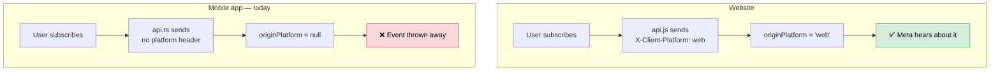
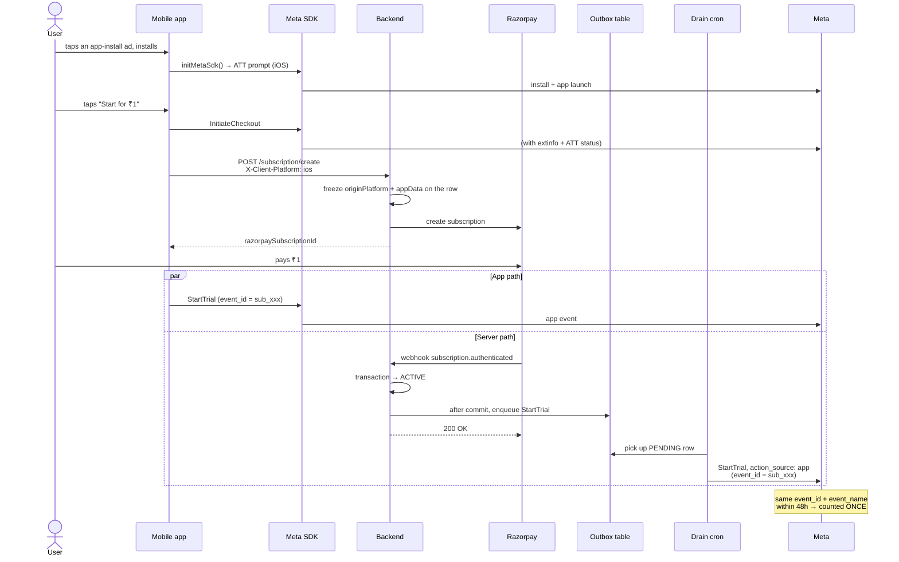

# Meta Ads Tracking — What the App Needs

The website already sends conversion data to Meta. The app sends nothing. This doc explains why that's a problem, what has to change, and exactly how to change it.

Written so you can read it top to bottom without knowing how ad tracking works.

---

## 1. The short answer

**Yes, the app needs changes.** Two separate pieces of work, and they're very different sizes:

|            | What                         | How long    | Do it when                                |
| ---------- | ---------------------------- | ----------- | ----------------------------------------- |
| **Part 1** | Send one HTTP header         | ~15 minutes | Now. Today.                               |
| **Part 2** | Full app conversion tracking | 1–2 weeks   | Before you spend money on app-install ads |

Part 1 is basically free and you should just do it. Part 2 is a real project.

---

## 2. Why you can't skip this

Here's the thing people get wrong: _"our backend already talks to Meta, so app sales are covered."_

They are not. Let me show you why.

Right now, when someone subscribes, the backend has to decide whether to tell Meta about it. It decides by looking at a field called `originPlatform` on the subscription row:

```ts
// bombay-canvas-be/src/services/metaEvents.service.ts:451
function isWebOrigin(originPlatform?: string | null): boolean {
  if (originPlatform == null) return false;
  return String(originPlatform).trim().toLowerCase() === WEB_PLATFORM; // "web"
}
```

If it isn't exactly `"web"`, nothing gets sent. And where does `originPlatform` come from? A header called `X-Client-Platform` on the request that created the subscription.

The website sends it. The app doesn't:

```ts
// bombay-canvas-app/src/utils/api.ts:41-48 — as it exists today
headers: {
  Accept: 'application/json, text/plain, */*',
  'Accept-Language': 'en-GB,en;q=0.9',
  ...(isFormData ? {} : { 'Content-Type': 'application/json' }),
  Authorization: accessToken ? `Bearer ${accessToken}` : '',
  ...headers,
},
// no X-Client-Platform anywhere
```

So every app subscription lands in the database with `originPlatform = null`, and the backend throws the event away.



**Important: this is not a bug.** Throwing the event away is deliberate and correct. If the backend guessed "probably web" for app sales, your web ad campaigns would get credit for sales they didn't cause, and you'd pour money into a campaign based on someone else's results. Silently dropping the data is worse than nothing, but reporting it _wrong_ is worse than both.

The problem is that if the app is where most of your revenue happens, most of your revenue is invisible to Meta.

---

## 3. Why the backend can't fix this alone

Reasonable next question: _"the backend knows the sale happened — why can't it just tell Meta and be done?"_

Because Meta needs more than "a sale happened." It needs to figure out **which ad caused it**, and the pieces required for that only exist inside the app.

| Missing piece                      | Why the backend can't produce it                                                                                                                                                                                                               |
| ---------------------------------- | ---------------------------------------------------------------------------------------------------------------------------------------------------------------------------------------------------------------------------------------------- |
| **What ad they clicked**           | On web, Meta puts `?fbclid=abc123` in the URL and the browser saves it. There is no URL in an app. App installs get attributed through the Google Play install referrer or Apple's SKAdNetwork, and neither of those ever touches your server. |
| **Device fingerprint (`extinfo`)** | Meta requires app events to carry an array describing the device — OS version, model, locale, timezone, screen size, bundle ID. The Meta SDK builds this automatically. Your server sees an HTTP request, not a phone.                         |
| **App ID**                         | Meta needs to know _which app_. You don't have a Meta app registered yet.                                                                                                                                                                      |
| **iOS tracking permission**        | Apple requires a popup asking "can this app track you?" Meta needs the answer. Only the app can ask.                                                                                                                                           |
| **`action_source: 'app'`**         | Your `buildEvent()` currently receives `actionSource` as an input and every caller passes `"website"`. Saying `website` for an app sale is lying to Meta, and their terms require this field be accurate.                                      |

So the backend genuinely cannot do this by itself. The app has to participate.

---

## 4. Part 1 — Send the platform header

**Start here.** Fifteen minutes, essentially zero risk, and it makes everything after it easier.

### What it does

It does **not** turn on app conversion tracking. The backend still only reports `"web"`. What it buys you:

- Subscription rows record `'ios'` or `'android'` instead of `null`, so you can finally run a SQL query and see your web-vs-app revenue split
- When you debug later, you can tell "this was an app user" apart from "the header got eaten by a proxy" — right now both look identical
- Part 2 needs this anyway, so it's not throwaway work

### The good news

The backend already accepts these values. You don't have to change anything server-side:

```ts
// bombay-canvas-be/src/utils/requestOrigin.ts:23-25
export type OriginPlatform = 'web' | 'ios' | 'android';

const ALLOWED_PLATFORMS: readonly OriginPlatform[] = ['web', 'ios', 'android'];
```

`ios` and `android` are already valid. They're accepted, validated, and stored — just not reported to Meta yet.

### The change

One file. `Platform` is already imported at the top of `src/utils/api.ts`, so there's nothing new to add there.

```ts
// bombay-canvas-app/src/utils/api.ts

// Add near the top, below the existing imports:

/**
 * Tells the backend which client this request came from. It gets frozen onto
 * Subscription/Purchase rows at create time as `originPlatform`, because the
 * Razorpay webhook that activates the row later has no request context and
 * can't read a header.
 *
 * The backend accepts exactly "web" | "ios" | "android" and treats anything
 * else as unknown (see requestOrigin.ts). Platform.OS is "ios" | "android" on
 * every build we ship, so the mapping is direct.
 */
const CLIENT_PLATFORM = Platform.OS === 'ios' ? 'ios' : 'android';
```

Then add one line inside the `headers` object in `api()`:

```ts
const requestConfig: RequestInit = {
  method: config.method ?? 'GET',

  headers: {
    Accept: 'application/json, text/plain, */*',
    'Accept-Language': 'en-GB,en;q=0.9',
    ...(isFormData ? {} : { 'Content-Type': 'application/json' }),
    Authorization: accessToken ? `Bearer ${accessToken}` : '',
    'X-Client-Platform': CLIENT_PLATFORM, // ← add this line
    ...headers,
  },
  credentials: 'include',
  // ...
};
```

That's it. Every call goes through this wrapper, so every request gets the header.

### One thing to double-check

Search for any `fetch()` that skips the wrapper. On the web repo three of these existed and one of them was the payment verification call — easy to miss, and the most important one:

```bash
cd bombay-canvas-app
grep -rn "fetch(" src | grep -v "src/utils/api.ts"
```

If any hit is a call to your own backend, add the header there too.

### How to check it worked

Subscribe from the app, then look in the database:

```sql
SELECT id, "originPlatform", "createdAt"
FROM "Subscription"
ORDER BY "createdAt" DESC
LIMIT 5;
```

You want `ios` or `android` instead of `null`. Backend logs will still say the event was suppressed — that's correct and expected until Part 2.

---

## 5. Part 2 — Real app conversion tracking

This is the actual project. Read all of it before starting anything.

### 5.1 First decision: Meta SDK or an MMP?

Two ways to do this, and picking wrong means redoing the work.

**Option A — Meta SDK directly** (`react-native-fbsdk-next`)

Meta's own library. Cheapest and fastest.

- ✅ Free, roughly a week of work
- ✅ Nothing between you and Meta
- ❌ **Meta only.** The day you run Google App Campaigns or Apple Search Ads, you install a second SDK and neither one knows about the other — so the same sale gets claimed by both networks and your numbers stop making sense.

**Option B — an MMP** (AppsFlyer, Adjust, or Branch)

An MMP is a referee. Every ad network reports to it, it decides which network actually earned each install, and then it forwards results to each of them.

- ✅ One SDK covers every network, forever
- ✅ Handles cross-network deduplication and click fraud
- ✅ Handles the iOS SKAdNetwork mess for you, which is genuinely unpleasant to do by hand
- ❌ Costs money (roughly $500+/month at the entry tiers)
- ❌ ~2 weeks of work

**Recommendation:** if the app is the business and you'll ever advertise outside Meta, go with **B**. Almost every app company at meaningful scale runs an MMP, and switching later means redoing all of this.

The rest of this doc describes **Option A**, because it's the smaller version and the concepts carry over. An MMP replaces sections 5.3 and 5.4 with its own SDK, and section 5.5 stays basically the same.

### 5.2 Register the app with Meta

Do this before writing code — the app repo needs the App ID.

1. Go to **developers.facebook.com/apps** → **Create App**
2. Type: **Consumer**. Name it `Bombay Canvas`
3. Add the **Facebook Login** product (you don't have to use it — it's how you unlock the platform settings)
4. Settings → Basic → scroll down → **Add Platform**:
   - **iOS** → Bundle ID: `com.bombaycanvas.app1`
   - **Android** → Package Name: `com.bombaycanvas`, and paste your release key hash
5. Copy the **App ID** and **Client Token** (Settings → Advanced → Client Token)
6. **Link it to your existing dataset.** Events Manager → dataset `canvasott` (ID `2057047929031192`) → Settings → Connected assets / Data sources → add the app

That last step matters. If the app reports to a different dataset than the website, you get two separate piles of data that never talk to each other — and your dedup between app-client and server events breaks.

To get the Android key hash:

```bash
keytool -exportcert -alias <your-alias> -keystore my-new-release-key.jks \
  | openssl sha1 -binary | openssl base64
```

(That keystore is already sitting at the root of the app repo.)

### 5.3 App repo: install and configure

```bash
cd bombay-canvas-app
npm install react-native-fbsdk-next react-native-tracking-transparency
cd ios && pod install && cd ..
```

**iOS — `ios/bombaycanvas/Info.plist`**

```xml
<key>FacebookAppID</key>
<string>YOUR_APP_ID</string>
<key>FacebookClientToken</key>
<string>YOUR_CLIENT_TOKEN</string>
<key>FacebookDisplayName</key>
<string>Bombay Canvas</string>

<!-- Apple requires this text before you may show the tracking popup.
     Be honest and specific — vague wording gets apps rejected. -->
<key>NSUserTrackingUsageDescription</key>
<string>We use this to understand which ads bring people to Bombay Canvas, so we can show you more relevant ones.</string>

<!-- Meta's SKAdNetwork IDs. Copy the current list from Meta's docs —
     it changes, and a stale list quietly costs you iOS attribution. -->
<key>SKAdNetworkItems</key>
<array>
  <dict>
    <key>SKAdNetworkIdentifier</key>
    <string>v9wttpbfk9.skadnetwork</string>
  </dict>
  <!-- ...the rest of Meta's list... -->
</array>
```

**Android — `android/app/src/main/AndroidManifest.xml`**

```xml
<uses-permission android:name="com.google.android.gms.permission.AD_ID" />

<application ...>
  <meta-data android:name="com.facebook.sdk.ApplicationId"
             android:value="@string/facebook_app_id" />
  <meta-data android:name="com.facebook.sdk.ClientToken"
             android:value="@string/facebook_client_token" />
</application>
```

And in `android/app/src/main/res/values/strings.xml`:

```xml
<string name="facebook_app_id">YOUR_APP_ID</string>
<string name="facebook_client_token">YOUR_CLIENT_TOKEN</string>
```

### 5.4 App repo: the analytics module

Copy the website's structure. It has exactly one file that anything else imports, so the day you add a second ad platform you edit one file instead of forty.

Create `src/utils/analytics/meta.ts`:

```ts
import { AppEventsLogger, Settings } from 'react-native-fbsdk-next';
import {
  getTrackingStatus,
  requestTrackingPermission,
} from 'react-native-tracking-transparency';
import { Platform } from 'react-native';

/**
 * iOS only. Apple requires an explicit prompt before an app may use the
 * advertising identifier. Android has no equivalent — getTrackingStatus()
 * returns 'unavailable' there, which we treat as allowed.
 *
 * Ask at a moment the user understands WHY, not on first launch. A cold prompt
 * gets denied far more often, and a denial is permanent unless the user digs
 * into iOS Settings.
 */
export const initMetaSdk = async (): Promise<void> => {
  if (Platform.OS === 'ios') {
    let status = await getTrackingStatus();

    if (status === 'not-determined') {
      status = await requestTrackingPermission();
    }

    const allowed = status === 'authorized' || status === 'unavailable';

    // Must be set BEFORE initializeSDK, or the first events go out with the
    // wrong permission state attached and Meta discards them.
    await Settings.setAdvertiserTrackingEnabled(allowed);
  }

  Settings.initializeSDK();
};

/**
 * Every tracked action in the app goes through this one function.
 *
 * `eventId` is the deduplication key. The backend reports these same
 * conversions through the Conversions API, and Meta merges the two into ONE
 * conversion only when event_name AND event_id both match, within 48 hours.
 *
 * If we don't have the id, we send NOTHING. An unkeyed event can't merge, so
 * sending it would guarantee the double-count we're trying to avoid. A missing
 * conversion is recoverable; a phantom one corrupts every average built on it.
 */
export const track = (
  eventName: string,
  params?: { value?: number; currency?: string },
  eventId?: string,
): void => {
  const payload: Record<string, string | number> = {};

  if (eventId) payload.event_id = eventId;
  if (params?.currency) payload.fb_currency = params.currency;

  if (params?.value !== undefined) {
    AppEventsLogger.logEvent(eventName, params.value, payload);
    return;
  }

  AppEventsLogger.logEvent(eventName, payload);
};
```

And `src/utils/analytics/index.ts` — the single door everything else imports:

```ts
export { track, initMetaSdk } from './meta';
```

Call the init once, in `App.tsx`, next to where Google Sign-In is already configured:

```tsx
// App.tsx
import { initMetaSdk } from './src/utils/analytics';

export default function App() {
  useEffect(() => {
    GoogleSignin.configure({
      webClientId: WEB_CLIENT_ID,
      iosClientId: IOS_CLIENT_ID,
    });

    initMetaSdk().catch(err =>
      // Tracking must never break the app.
      console.warn('[analytics] Meta SDK init failed', err),
    );
  }, []);
  // ...
}
```

### 5.5 App repo: fire the events

`src/screens/SubscriptionScreen.tsx` already has everything you need — it just has to call `track()` at three points inside `handlePurchase`.

**The dedup keys are the important part.** Both the app and the backend report the same conversion, so they must derive the same ID independently. Razorpay's own IDs are perfect for this: both sides see the identical string, and no coordination is needed.

| Event        | App uses                           | Backend uses                          |
| ------------ | ---------------------------------- | ------------------------------------- |
| `StartTrial` | `createRes.razorpaySubscriptionId` | `subscription.razorpaySubscriptionId` |
| `Subscribe`  | `paymentData.razorpay_payment_id`  | `charge.razorpayPaymentId`            |

```tsx
import { track } from '../utils/analytics';

const handlePurchase = async (plan: 'trial' | 'monthly' | 'annual') => {
  const planCode =
    plan === 'trial' ? 'TRIAL' : plan === 'annual' ? 'ANNUAL' : 'MONTHLY';
  const planValue =
    planCode === 'ANNUAL' ? 499 : planCode === 'MONTHLY' ? 99 : undefined;

  // 1. They opened checkout. No dedup key — the backend never reports this one,
  //    so there's nothing to merge with.
  track('InitiateCheckout', { value: planValue, currency: 'INR' });

  setLoading(true);
  try {
    const createRes = await createSubMutation.mutateAsync(planCode);
    // ...existing Razorpay setup, unchanged...

    const paymentData: any = await new Promise((resolve, reject) => {
      RazorpayCheckout.open(options as any)
        .then(resolve)
        .catch(reject);
    });

    await verifySubMutation.mutateAsync({
      razorpay_payment_id: paymentData.razorpay_payment_id,
      razorpay_subscription_id: paymentData.razorpay_subscription_id,
      razorpay_signature: paymentData.razorpay_signature,
    });

    // 2. Money changed hands. Fire immediately — do NOT wait for the /me poll
    //    below, because the user can background the app at any point during it.
    if (planCode === 'TRIAL') {
      // No value. The trial charges ₹1 to authorise the mandate, and reporting
      // ₹1 would make Meta optimise for ₹1 conversions when the real plan is
      // ₹499 — off by about 500x. The real price goes in predicted_ltv, which
      // the backend already sends.
      track('StartTrial', undefined, createRes.razorpaySubscriptionId);
    } else {
      track(
        'Subscribe',
        { value: planValue, currency: 'INR' },
        paymentData.razorpay_payment_id,
      );
    }

    // ...existing polling loop, unchanged...
  } catch (err) {
    // ...
  }
};
```

For `ViewContent`, add one line to the series detail screen:

```tsx
useEffect(() => {
  if (series?.id) track('ViewContent');
}, [series?.id]);
```

**Don't fire `CompleteRegistration` from the app.** When someone signs in with Google, the API returns `{ token, user }` and nothing that says "this person is brand new." The app cannot tell a first-time signup from a returning login, so firing here would count every returning login as a new registration and the number would be garbage. The backend already handles it — it's the thing running `prisma.user.create()`, so it actually knows (`auth.controller.ts:1080`).

### 5.6 Backend changes

The app half alone isn't enough. Three changes on `bombay-canvas-be`.

**a) Stop suppressing app platforms**

Right now everything non-web is dropped. That check has to grow into a router:

```ts
// src/services/metaEvents.service.ts

/**
 * Which Meta action_source a stored originPlatform maps to, or null when the
 * origin is unknown and must not be reported at all.
 *
 * Default-deny is deliberate: an absent header means "we don't know", and
 * guessing in the permissive direction pollutes the exact data we built this
 * to collect.
 */
function resolveActionSource(
  originPlatform?: string | null,
): 'website' | 'app' | null {
  const platform = String(originPlatform ?? '')
    .trim()
    .toLowerCase();

  if (platform === 'web') return 'website';
  if (platform === 'ios' || platform === 'android') return 'app';
  return null;
}
```

**b) Attach `app_data` to app events**

Meta rejects app events that don't describe the device. That means `buildEvent()` grows an optional `appData`, and `MetaCapiEvent` grows the matching field:

```ts
function buildEvent(input: {
  eventName: string;
  eventId: string;
  actionSource: MetaCapiEvent['action_source'];
  userData: MetaUserData;
  amountPaise?: number | null;
  predictedLtvPaise?: number | null;
  appData?: MetaAppData | null; // ← new
}): MetaCapiEvent {
  // ...existing body...

  return {
    event_name: input.eventName,
    event_time: Math.floor(Date.now() / 1000),
    event_id: input.eventId,
    // event_source_url only means something for web. Meta ignores it on app
    // events, but sending a website URL on an app conversion is misleading.
    ...(input.actionSource === 'website'
      ? { event_source_url: META_EVENT_SOURCE_URL }
      : {}),
    action_source: input.actionSource,
    user_data: input.userData,
    ...(input.appData ? { app_data: input.appData } : {}),
    ...(hasCustomData
      ? { custom_data: { ...customData, currency: CURRENCY } }
      : {}),
  };
}
```

**c) Store the device info at subscribe time**

Same reason `originPlatform` gets frozen on the row: the Razorpay webhook fires minutes later with no request context, so anything the webhook needs must already be saved.

This means a migration adding an `appData` JSON column to `Subscription`, populated in `subscription.create` from a header the app sends. `src/utils/requestOrigin.ts` is where the parsing goes — it already handles `originPlatform`, `fbp`, and `fbc` the same way.

> ⚠️ Copy the pattern from the existing code carefully. The new columns must be written **inside** `subscription.create`, and anything Meta-related that could fail must stay **outside** the transaction. There's a full writeup of why in `bombay-canvas-fe/docs/meta-ads-tracking-explained.md` §5 — a `try/catch` around a database call inside a Postgres transaction does not make it safe, and getting it wrong once cost a test subscription its ACTIVE status silently.

### 5.7 The whole flow, end to end



The reason both paths exist: if the user backgrounds the app right after paying, the left branch never runs. The right branch still delivers the conversion. That's the entire point of doing it twice.

---

## 6. How to test it

You cannot test app tracking on a simulator — no advertising ID, no ATT prompt. Use a real device.

1. **Meta's Event Debugger.** Events Manager → your app → **Test Events** → App tab. Shows events arriving live.
2. **iOS: test both ATT answers.** Allow _and_ deny. Denying should not crash anything or block the purchase — it should just reduce match quality.
3. **Check the dedup.** Complete a real trial. You should see `StartTrial` twice — once from the app, once from the server — carrying the same `sub_...` event ID, and Meta should mark them merged.
4. **Watch the backend log** for the drain:
   ```
   [meta-events] enqueued StartTrial (initial) { eventId: 'sub_...' }
   [CRON] Running meta outbox drain
   [meta-capi] sent 1 event(s) [StartTrial] — received 1
   ```
5. **Reset between runs.** iOS: Settings → General → Transfer or Reset → Reset → Advertising Identifier. Otherwise your device looks like the same user every time.

---

## 7. What this does not cover

Being explicit so nobody assumes coverage that isn't there.

| Not included                  | Why                                                                                                                                                                                  |
| ----------------------------- | ------------------------------------------------------------------------------------------------------------------------------------------------------------------------------------ |
| **Install attribution**       | Knowing which ad caused an _install_ (as opposed to a purchase) needs SKAdNetwork on iOS and install referrer on Android. The SDK does some of this; an MMP does all of it properly. |
| **Deep links from ads**       | Tapping an ad and landing on the right series page needs Universal Links (iOS) + App Links (Android). Separate project, worth doing — it measurably improves conversion.             |
| **Refunds and cancellations** | Meta publishes no supported way to report a refund. No refund event, no negative value, no API to amend a sent event. Reconcile in your own analytics.                               |
| **TVOD one-off purchases**    | Only subscriptions are covered here.                                                                                                                                                 |
| **Consent screen**            | India's DPDP Act consent-manager provisions land 13 Nov 2026, substantive obligations 13 May 2027. Worth revisiting before then.                                                     |

---

## 8. Checklist

**Part 1 — do now**

- [ ] Add `X-Client-Platform` to `src/utils/api.ts`
- [ ] `grep` for raw `fetch()` calls that bypass the wrapper
- [ ] Ship it, then confirm `originPlatform` is `ios`/`android` in the database

**Part 2 — before spending on app ads**

- [ ] Decide: Meta SDK vs MMP _(this is the fork — decide before writing any code)_
- [ ] Create the Meta app, add iOS + Android platforms, get App ID and Client Token
- [ ] Link the app to dataset `canvasott` (`2057047929031192`)
- [ ] Install `react-native-fbsdk-next` + `react-native-tracking-transparency`
- [ ] Configure `Info.plist` (incl. `NSUserTrackingUsageDescription` + SKAdNetwork IDs) and `AndroidManifest.xml`
- [ ] Build `src/utils/analytics/`, call `initMetaSdk()` in `App.tsx`
- [ ] Fire `InitiateCheckout` / `StartTrial` / `Subscribe` in `SubscriptionScreen.tsx` with Razorpay IDs as `event_id`
- [ ] Fire `ViewContent` on the series screen
- [ ] Backend: `resolveActionSource()` replacing `isWebOrigin()`
- [ ] Backend: `app_data` on `buildEvent()`, migration for the new column
- [ ] Test on real devices, both ATT answers, verify dedup

---

## Related

- `bombay-canvas-fe/docs/meta-ads-tracking-explained.md` — the web implementation. Read §5 (the transaction bug) and §7.1 (deduplication) before touching the backend.
- Dataset: `canvasott`, ID `2057047929031192`
