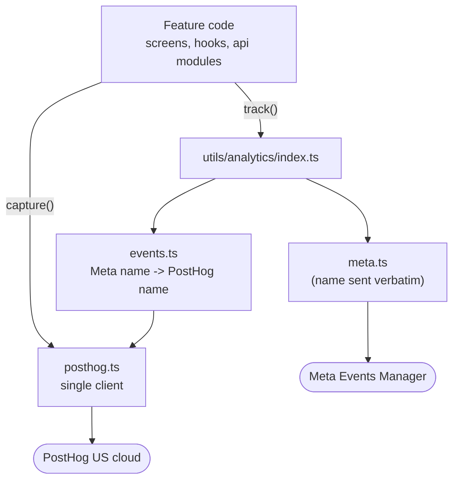

# PostHog Events — What We Track and Why

This doc is the reference for product analytics in the React Native app. It covers what each event means, exactly which properties it carries, and why several deliberate-looking oddities are the way they are.

Written so you can read it start to finish without already knowing PostHog.

---

## 1. PostHog is not Meta, and it does not replace it

The app already had Meta tracking before any of this. The two answer different questions and both still run:

| | Meta (Pixel + Conversions API) | PostHog |
| --- | --- | --- |
| Purpose | Ad attribution — feeds ad-set optimisation | Product analytics — funnels, retention, cohorts |
| Question it answers | "Which ad brought a subscriber?" | "Where do people drop out of onboarding?" |
| Event names | Meta's **fixed** standard list | Our own snake_case vocabulary |

Nothing about Meta changed. PostHog was added as a second provider behind the same `track()` call sites.

---

## 2. How it is wired

Every call site imports from `src/utils/analytics/index.ts` and nowhere else. That file exposes **two verbs**, and the difference matters:



**`track(name, params, eventId)`** — goes to **both**. Reserved for the four names Meta actually optimises ad delivery on, plus the cancel-flow funnel. The name is Meta's; `events.ts` translates it for PostHog.

**`capture(name, props)`** — **PostHog only**. Everything Meta has no use for. Sending these to Meta would register them as custom events no ad set optimises for — noise in Events Manager that dilutes the four names that matter.

### The one client

`posthog.ts` builds the client at module scope and `App.tsx` hands it to the provider via `client={posthog}`. This is deliberate: most tracking fires from plain modules (the navigation container, the checkout hook, the auth store) that no React context can reach. If the provider built its own from an `apiKey` prop instead, there would be **two clients** with separate sessions and conflicting `distinct_id`s.

`autocapture={{ captureScreens: false }}` is also required. Screen autocapture defaults to ON and mounts a hook calling `useNavigationState()`, which throws unless it renders inside a `NavigationContainer` — the provider sits above the navigator. It would also double-count, since `routes.tsx` reports screens itself. Note it is **not** `autocapture={false}`: that would silently also disable app lifecycle events.

---

## 3. Who the events belong to

`distinct_id` is the backend **`User.id`** on every platform. Not email, not a device id — it is the only identifier the app, the web client and the server all agree on, so it is what keeps one human as one person across devices and platforms.

| Moment | What happens |
| --- | --- |
| Before sign-in | PostHog's own anonymous id |
| On sign-in | `identify(User.id, {email, name, role})`; PostHog merges the anonymous history into that person |
| Cold start | Re-identify is **skipped** if the id is unchanged (guarded in `posthog.ts`) so a relaunch is not a billable `$identify` |
| On logout | `reset()` — mandatory, or the next person on a shared device inherits the previous user's identity |

**Email and name live on the person profile, never on events.** A profile is one record you can delete on request; PII sprayed across millions of events is not.

---

## 4. Dual-provider events (Meta **and** PostHog)

### `$screen`
Every navigation. Fired from `routes.tsx` (`onReady` + `onStateChange`).

The screen name is the event's identity, not a property — it is deliberately removed from the property bag so it does not double-count in breakdowns.

### `content_viewed` — *Meta: `ViewContent`*
A series detail page was opened. Fired once per series, guarded by a ref.

| Property | Example |
| --- | --- |
| `series_id` | `"clx123..."` |
| `series_title` | `"Bombay Diaries"` |
| `genre` | first genre, or `"unknown"` |
| `episode_count` | `12` |
| `creator_id` | uploader id — answers "which creators drive views" |
| `release_year` | `2024` |
| `is_paid_series` | `true` |

> **Why the ref guard.** `VideoPlayer.reportProgress` rewrites this query via `queryClient.setQueryData` every 5–15s, producing a **new `series` object** each time, and this screen stays mounted under the player. Depending on the object would re-fire `content_viewed` throughout playback and wildly inflate view counts.

### `checkout_started` — *Meta: `InitiateCheckout`*
The user opened a payment sheet. Fired from **two** places: `useSubscriptionCheckout.ts` and `SubscriptionScreen.tsx`.

| Property | Notes |
| --- | --- |
| `plan_code` | `TRIAL` / `MONTHLY` / `ANNUAL` |
| `rail` | `razorpay` or `apple` |
| `is_trial` | separates two very different conversions |
| `plan_price_inr` | hook only — the real price even on a trial, where `value` is absent |
| `value`, `currency` | rupees, `INR`. Absent on trials |

### `trial_started` — *Meta: `StartTrial`*
Trial purchased. Carries the same plan/rail block plus `dedup_key`.

No `value`. The ₹1 Razorpay mandate authorisation is not what the plan is worth, and Apple's trial costs nothing.

### `subscription_started` — *Meta: `Subscribe`*
Paid plan purchased. Plan/rail block + `value`, `currency`, `dedup_key`.

> **`dedup_key`** is the id the backend reports the same conversion under (a Razorpay payment id, an Apple transaction id). Meta uses it to merge the client and server events instead of double-counting. It rides along into PostHog as an ordinary property because it is the only column that lets a PostHog funnel be joined back to a real payment row.

### The cancel funnel

Eight events, and **all of them carry the same `cancelContext`**:

| Shared property | Value |
| --- | --- |
| `plan_code` | the plan being cancelled |
| `rail` | which rail **sold** it — not necessarily the rail this build sells through |
| `status` | `ACTIVE` / `TRIAL` / … |
| `is_trial` | inside the trial window right now |
| `cancel_at_period_end` | already scheduled to lapse |

This uniformity is the point: a funnel is only readable if every step can be broken down the same way. `rail` matters most — Razorpay cancels immediately server-side while Apple can only open the system sheet, so the two have genuinely different funnels and averaging them hides both.

| Event | Extra properties |
| --- | --- |
| `cancel_flow_opened` | — |
| `cancel_flow_reason_selected` | `reason_code` |
| `cancel_flow_reached_confirm` | `reason_code` |
| `cancel_flow_downsell_accepted` | `from_plan`, `to_plan`, `to_plan_price_inr` |
| `cancel_flow_saved` | `reason_code`, `saved_at_step`, `to_plan` (downsell path) |
| `cancel_flow_abandoned` | `saved_at_step` |
| `cancel_flow_completed` | `reason_code`, `downsell_abandoned` |
| `cancel_flow_deferred_to_store` | `reason_code` |

Exactly one of *saved / abandoned / completed / deferred* fires per flow — a ref guard makes double-taps and re-renders unable to double-count.

> **`cancel_flow_deferred_to_store` is not a cancellation.** On iOS the app can only open the system sheet; our server does not learn the outcome until Apple's notification lands. Counting it as a completion would overstate churn on iOS.

---

## 5. PostHog-only events

### Playback

All four share the same identity block:

| Property | Notes |
| --- | --- |
| `episode_id`, `episode_title` | |
| `series_id` | |
| `duration_seconds` | rounded |

| Event | When | Extra |
| --- | --- | --- |
| `video_playback_started` | first **progress tick**, not on load | — |
| `video_progress` | crossing 25 / 50 / 75% | `milestone_pct` |
| `video_completed` | player `onEnd` | — |
| `video_playback_failed` | player surfaced an error | `error_code` |

> **Milestones, not heartbeats.** `reportProgress` already writes to our backend every 5–15s. Mirroring that into PostHog would bill **~180 events for one 30-minute episode**. PostHog charges per event, so on an OTT catalogue that is the difference between a manageable bill and a five-figure one. Three milestones answer the same drop-off question for ~2% of the volume.
>
> **100% is deliberately absent** — completion is `video_completed`, and having both would double-count every finished episode.
>
> **Started fires on the first progress tick**, not `handleLoad`. Loading only means the episode became active; a progress tick means the media is genuinely advancing. The gap is every user who lands on an episode and scrolls straight past.
>
> `locked` and `is_paid_episode` are **not** sent: both render an overlay *instead of* the `<Video>`, so neither can ever be true here and both would ship as constant `false`.
>
> `error_code` is the code only, never the raw error payload — that can carry signed playback URLs.

### `paywall_opened`
Locked content asked to be paid for. Fired from `useOpenPaywall`, which every entry point routes through — the player, the series screen and the episode list — so one call covers all three.

| Property | Notes |
| --- | --- |
| `series_id`, `series_title`, `genre`, `creator_id` | what they were trying to watch |
| `outcome` | `trial_prompt` (trial spent) or `subscription_screen` |
| `trial_consumed` | drives that branch |
| `rail` | which store they would pay through. No plan yet — that is chosen on the next screen |

### `search_performed`
A debounced search settled.

| Property | Notes |
| --- | --- |
| `query` | trimmed, lowercased, capped at 100 chars |
| `result_count` | |
| `has_results` | zero-result searches are the clearest catalogue-gap signal you get |

> Guarded against re-firing: the effect also depends on `movieData`, so a background refetch would otherwise inflate the search count and make zero-result searches look more common than they are.
>
> `query` is the one place user-typed text reaches an event. It is deliberate and it is the most valuable property here, but it is worth knowing it exists.

### Auth

| Event | Properties |
| --- | --- |
| `otp_requested` | `method: phone_otp` |
| `signed_in` | `method`, `role`, `needs_profile` (phone only) |
| `signed_up` | `method: email`, `role` |
| `auth_failed` | `method`, `stage`, `reason` |
| `account_deleted` | `role` |

`method` is one of `email` / `google` / `apple` / `phone_otp`.
`stage` is one of `otp_request` / `otp_verify` / `login` / `signup`.

> **`signed_up` is email-only, and that is not an oversight.** Google, Apple and phone all create the account on first use, and their endpoints answer `{ token, user }` with **no `isNewUser` flag** — the backend documents this explicitly in `auth.controller.ts` (`fireCompleteRegistration`) as the reason it fires Meta's `CompleteRegistration` server-side. Phone additionally uses `prisma.user.upsert`, so the create-vs-update fork is not observable at the call site at all. Guessing on the client would count every returning Google login as a fresh registration and inflate signups permanently. Only `/api/auth/signup` is unambiguous. For the others, PostHog's own first-seen date answers "is this person new".
>
> **`otp_requested` carries no phone number.** It is right there in scope; it is exactly the kind of PII that should not sit on an event.
>
> **`account_deleted` fires *before* `logout()`**, which calls `reset()`. After that the person is unbound and the event would land on a fresh anonymous id — useless for churn.

### `subscription_cancelled`
A cancellation the **server confirmed**. Carries the full `cancelContext` plus `reason_code` and `downsell_abandoned`.

Distinct from `cancel_flow_completed`, which is a funnel step. This is the churn fact itself, so it is fired only where a cancellation actually happened — never on the Apple deferred branch.

`downsell_abandoned: true` means the cancel succeeded but the user backed out of the replacement purchase. Still a real cancellation, flagged so the two stay separable.

No amounts are sent. `amountSnapshot` is in paise and, per the comment in `api/subscription.ts`, is **not** what an App Store buyer is charged — a Californian on $59.99 still shows `49900`. `plan_code` carries the tier unambiguously.

---

## 6. Automatic events

The SDK sends these with no code from us: `Application Installed`, `Application Opened`, `Application Updated`, `Application Backgrounded`, plus `$identify` on sign-in.

Session replay is **off**. The app's main surface is a full-bleed video player; a replay of it is a black rectangle that still bills as a replay.

---

## 7. Booleans

`track()` accepts booleans, but Meta's `AppEventsLogger` takes only strings and numbers, so `meta.ts` stringifies them at the Meta boundary. PostHog receives the real boolean. This is why `downsell_abandoned` is `true` in code and arrives at Meta as `"true"`.

---

## 8. Where things live

| File | Role |
| --- | --- |
| `src/utils/analytics/index.ts` | The only import surface. `track()` / `capture()` |
| `src/utils/analytics/posthog.ts` | The single client + `identify` / `reset` |
| `src/utils/analytics/events.ts` | Meta name → PostHog name. Pure, no I/O |
| `src/utils/analytics/productEvents.ts` | Event-name constants + milestone logic. Pure |
| `src/utils/analytics/meta.ts` | Meta provider (pre-existing) |
| `src/utils/analytics/analytics.test.ts` | 21 tests over the pure logic |

Event names are **constants, never string literals at call sites**. A typo'd name is not rejected by PostHog — it silently creates a new event no insight is watching, and the gap surfaces weeks later when a question cannot be answered.

Unknown names passed to `track()` are **forwarded, not dropped** — auto-converted to snake_case. The cancel flow builds its terminal event name at runtime, so a closed map would silently lose `CancelFlow_Saved` / `CancelFlow_Abandoned`.

---

## 9. Config

```
POSTHOG_API_KEY=phc_...
POSTHOG_API_HOST=https://us.i.posthog.com
```

Both live in `.env` (gitignored) and are declared in `src/types/env.d.ts`. A **missing key is a supported state** — the client is constructed `disabled` and every call becomes a no-op, so a dev box with no credentials behaves like production minus the reporting.

`react-native-dotenv` inlines these **at bundle time**. After changing `.env` you must `npx react-native start --reset-cache` or the old values stay baked in.

The key must be the **project** API key (`phc_…`), not a personal API key. The US and EU clouds are separate ingestion hosts; a US key sends nothing to the EU host.

---

## 10. Verifying

1. Rebuild with `--reset-cache`, reinstall for lifecycle events.
2. Add `debug` to `<PostHogProvider>` temporarily — every capture logs to Metro.
3. Watch **Activity** in PostHog. Events batch at **20 events or every 10 seconds**, so allow ~10s.
4. Check identity: before login a random `distinct_id`; after login `$identify` with `distinct_id === User.id`; after logout a **new** anonymous id; after a relaunch **no second `$identify`**.

### "Remote config could not be loaded"

Harmless. Remote config has its own **3000 ms** budget while event capture uses **10000 ms**, and the failure is caught and logged — nothing downstream depends on it. It only carries feature flags, surveys and replay settings, none of which we use. It appears mainly in dev, because the client is built at module scope and the fetch fires during bundle startup while the JS thread is saturated.

---

## 11. Known gaps

- **Cross-method `signed_up`** needs an `isNewUser` flag on the Google / Apple / phone responses in `bombay-canvas-be`. Small backend change; the app side would follow.
- **`useRequest` (email signup) never calls `setUser`**, unlike every other auth path, even though the response contains `user`. Analytics works around it by identifying directly, but a freshly signed-up user likely has a null `user` in the auth store until something refetches. Worth fixing separately.
- **Store privacy declarations are not updated.** `ios/bombaycanvas/PrivacyInfo.xcprivacy` and the Play Data Safety form both need to declare what PostHog collects. **This is a release blocker.**
- **Web and backend are not integrated.** `distinct_id` is already standardised on `User.id`, so they will line up when they are.
